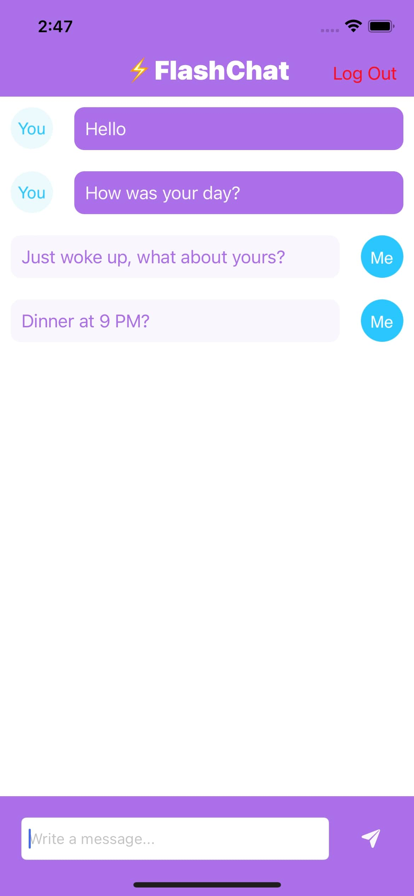

# Chat-App

  
   
  

# Description

Flash chat is a chat simulator app that uses FireBase for Authentication and chat storage

# Tools Used
### -  Swift  (Programming Language used on the entire Project)
### - FireBase. (Implement Authentication in the app so users can sign up and login, and use FireBase FireStore Database)
### - CocoaPods. (IQKeyboardManager
